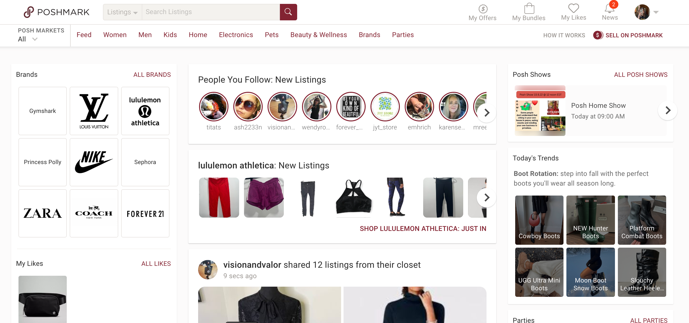
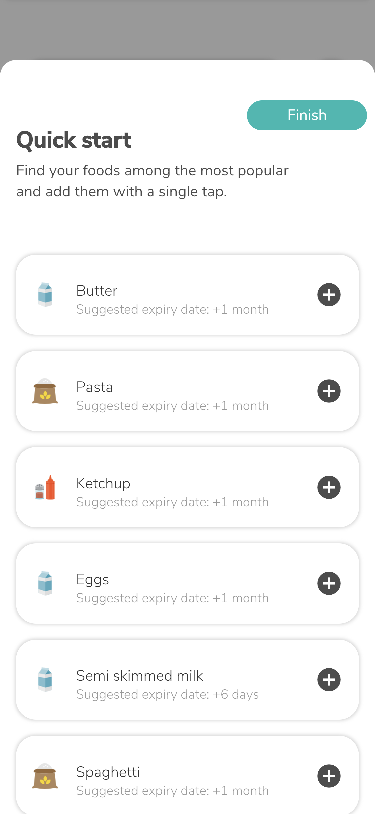

# Heuristic Evaluation: Consuming More Responsibly in Our Daily Lives

### Karen Li   |   DH 110

For the design challenge of this quarter, I chose the UN global goal “Responsible Production and Consumption”. Particularly, I want to focus on responsible consumption and how users can apply it to their own daily lives. Thus, I want to create a website/app that focuses on a specific way of consuming responsibly (e.g. secondhand shopping, reducing food waste) and improves on its current user experience. 

To conduct this analysis, I will be following the heuristics and severity ratings as outlined by Jakob Nielsen and the Nielson Norman group.

## The Ten Heuristics
1. Visibility of system status: users are able to know what is happening at all times.
2. Match between system and the real world: the design uses language and conventions that users are familiar with.
3. User control and freedom: users have control over their actions (e.g. undo, exit)
4. Consistency and standards: design choices are consistent throughout the product.
5. Error prevention: the design prevents and reduces any errors made.
6. Recognition rather than recall: the design minimizes the information a user has to memorize, by keeping important elements visible and offering suggestions.  
7. Flexibility and efficiency of use: the interface is tailored to both new and expert users, providing the latter with shortcuts.
8. Aesthetic and minimalist design: the design focuses on important elements, and is not crowded with unnecessary information.
9. Help users recognize, diagnose, and recover from errors: when an error is made, the interface quickly helps the user solve the issue.
10. Help and documentation: information to complete a task is easily accessible when the user requires it. 

## Severity Ratings
1 = the issue is only cosmetic; should be fixed if there is extra time  
2 = minor usability issue; low-priority  
3 = major usability issue; high-priority  

## Poshmark Website

<a href="http://poshmark.com" target="_blank"> Poshmark</a> is a website and app that allows users to sell and buy second-hand items, such as clothing, accessories, and home decor. Shopping second-hand is a great way to consume more responsibly. For this heuristic evaluation, I will be analyzing the website.

### Evaluation

**Overall:** The website feels very cluttered with text, especially when looking at the sidebar filters and categories of items in the header. The site also feels quite overwhelming; I can imagine a user that has not used a second-hand shopping site before would be quite confused. Additionally, the red and gray text make the site seem rather old. It does not have a clean, modern look. Buying items, however, does not seem difficult. Selling items is a different story as it requires filling out a lot of information. However, the app seems much more suited to list items to sell. There are definitely a lot of improvements that can be made to improve the user experience of the Poshmark website. 

| Heuristic | Evaluation | Improvement | Severity Rating |
| --------- | ---------- | ----------- | --------------- |
| Visibility of system status | Clickable items do not change color when hovered on. Moreover, some clickable items are gray, the same color as text that does not afford clicking. This means users may not know what is clickable and may easily misclick. | Add color feedback when clickable items are hovered over. | 2 |
| Match between system and the real world | There are several terms that expert users are familiar with, such as NWT (new with tags) and OS (one size). However, new users may not be familiar with these terms and Poshmark does not provide information about these terms. | When users use Poshmark for the first time, there should be a pop-up that gives them the meanings to these commonly used abbreviations. Moreover, this information should be in the FAQ section. | 2 |
| User control and freedom | The logo/name at the header of a website usually leads back to the home page. Once a user navigates to the Support and Help center and clicks on the header logo/name, no action is taken. The user will have to click on the back button of the browser in order to go back to the main Poshmark page. | Make the header logo/name in all subpages link back to the homepage. | 3 |
| Consistency and standards | Most of the buttons on the site are rectangles with pretty sharp edges. The search results for a specific item displays filters that can further narrow a search; these buttons have very round corners. | Make all the buttons consistent in shape. | 1 |
| Error prevention | If a user clicks on ‘Buy Now’ or ‘Make an Offer’, there is a confirmation button to ensure that they actually want to complete the action. This is good for preventing errors if users accidentally click on the buttons. | - | - |
| Recognition rather than recall | The left sidebar which contains filters disappears once a user has scrolled down several rows. This makes it difficult for the user to remember which filters they have checked off. | Keep the sidebar visible at all times. | 2 |
| Flexibility and efficiency of use | If a user searches for a particular item often, they have to type it out each time. The search bar does not save previously searched queries. | Save recent searches. | 3 |
| Aesthetic and minimalist design | There is usually a lot of text at all times so the site appears very busy. Particularly, the header has a ton of item categories to choose from. For instance, ‘Handbags’ lists Baby bags, hobos, mini bags, etc. which are not commonly searched bags. | Reduce the amount of categories. | 1 |
| Help users recognize, diagnose, and recover from errors | When a user logs in and inputs the wrong information, Poshmark doesn’t tell you if the username or password is incorrect. | Tell the user whether the username or password is invalid. | 2 |
| Help and documentation | There is a FAQ section as well as a Help and Support center so users can get help if needed. However, it is only accessible by the menu that is displayed when clicking on the user icon. | Add these sections to the footer, as many websites also display this information in their footers. | 3 |

## NoWaste Application

<a href="https://www.nowasteapp.com/" target="_blank"> NoWaste</a> is an application that allows users to log their food. It keeps track of the amounts of specific ingredients, expiration dates, etc. in order for users to plan their meals more efficiently and reduce food waste. Reducing food waste is another good method to achieve the UN goal of consuming responsibly. 

### Evaluation

**Overall:** I thought the NoWaste app required some discovery to understand the features as some of them were not intuitive. Personally, it was not difficult for me to figure out these features but it may be more troublesome for other users. The user interface is pleasing to the eye, as it is very simple and minimalistic in shapes and colors. I think it is a nice app to use, but improvements need to be made to make features more understandable. It would also be good to have an optional onboarding process. 

 Heuristic | Evaluation | Improvement | Severity Rating |
| --------- | ---------- | ----------- | --------------- |
| Visibility of system status | When first opening the application, there is a ‘Quick start’ feature where users can log ingredients. Once the user has added an ingredient, there is a pop-up at the bottom of the screen that says ‘Added!’. This pop-up can be easily missed and users cannot see how many times they have added an ingredient. Additionally, there appears to be an infinite list of ingredients, so users may scroll for a while before realizing this fact. | Update the ‘Quick start’ feature so users can clearly see whether they have added a specific ingredient. Add scroll bar. | 3 |
| Match between system and the real world | When searching for an ingredient, the suggested searches do not align with the first letter searched. For instance, if you type ‘h’, any ingredient with the letter h will be suggested. However, users usually do not type ingredients starting with letters in the middle of the word. | Give suggestions that match with the first letter of the search. | 2 |
| User control and freedom | If users delete a logged ingredient by accident, there is no undo button. They will have to manually add the item again; this is particularly troublesome if the user had written custom information within an ingredient. | Add an undo button. | 3 |
| Consistency and standards | A check mark usually indicates something is complete. In the case of this app, I would assume that if I were to tick off an ingredient, it would mean that I have consumed it. However, in NoWaste checking an ingredient off is to actually select it, which leads to a menu of options. | Change the check mark to a different icon or add a select button. | 2 |
| Error prevention | It is very easy to misclick and delete an ingredient from the shopping list since the ‘delete’ icon is next to the ‘in basket’ icon and both are quite small in size. | Add a confirmation screen when deleting ingredients. | 3 |
| Recognition rather than recall | For each ingredient, users can scroll through a list and place them into categories, such as fruits, vegetables, and dairy. This is helpful if users are having trouble recalling which category an ingredient falls into. | - | - |
| Flexibility and efficiency of use | Flexibility and efficiency of use: In general, the essential features are easy to learn for new users. Frequent users can discover more customizable options. | - | - |
| Aesthetic and minimalist design | The application is clean and does not have unnecessary or irrelevant information. | - | - |
| Help users recognize, diagnose, and recover from errors | Similar to Poshmark, the previous website, NoWaste does not specify whether a user has entered the email address or password incorrectly. Additionally, the app does not have the eye icon that usually allows the user to see the password entered. However, it does specify that a password has to be at least six letters if the user enters less than six letters. | Provide the user to see the password entered. Specify whether the email address or password is incorrect to the user. | 2 |
| Help and documentation | There is a ‘Help & Tips’ section, but it only contains videos. Some users may not want to watch tutorials and instead may want to read instructions. | Provide written help and tips to users. | 2 |

## Credits
Thank you to <a href="https://github.com/emdipressi/DH150-DiPressi" target="_blank"> Emily DePressi</a> and <a href="https://github.com/JoyHsieh/DH110-JoyHsieh-Assignment01/blob/main/README.md" target="_blank"> Joy Hsieh</a> for giving me inspiration for this layout!

