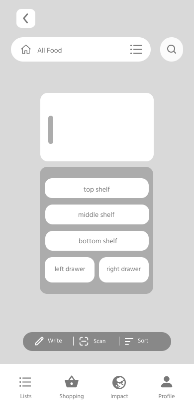
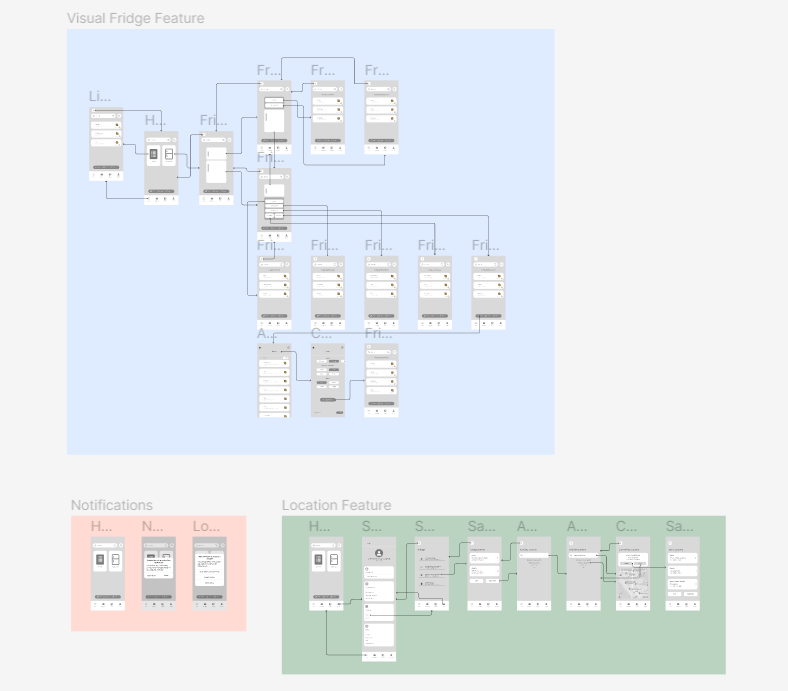

# DH 110: Low-Fidelity Prototyping
#### Karen Li | Fall 2022

## Description of Project
My user research focuses on reducing food waste, specifically via the NoWaste app which helps users to keep track of their food inventory and thus minimize the amount of food thrown away due to spoilage and expiration. Based on my user research, it seems that not many people know about food tracking apps and/or don’t feel the need to use them. My interviewee explained that she doesn’t need an app to track her food because she likes to open up her fridge to see what is inside. As such, my focus has now shifted to the following question: What can be improved to encourage and motivate more users to the app? 

I created my two personas and scenarios with this question in mind. The first persona, Margot, is a stay-at-home mom who buys groceries in bulk. She limits her grocery trips, because she is busy with her kids and wants to reduce her carbon footprint. However, she gets overwhelmed when looking at her fridge that is almost always stuffed with produce. Considering her situation as well as my user research, I designed the ‘Visual Fridge’ feature. It is a visual representation of the user’s fridge (and freezer), and they can click into specific sections (e.g. top shelf, left drawer, etc.) to log their food items. This allows them to see specifically where each item is in their fridge, rather than them only being able to view items in specific categories (i.e. fridge, freezer, pantry). 

My second persona, Chad, is a young professional who enjoys working out and eating a variety of high-protein foods. Sometimes, he makes multiple grocery shopping trips a week, because he forgets certain ingredients on his first grocery run. He also has trouble remembering the expiration dates of his food items. This forgetfulness is often due to him working at a fast-paced, stressful job in a big city. To solve Chad’s issue, I designed a ‘Notifications and Locations’ system for the app. The ‘Notifications’ part is simply asking the user to allow the app to send them notifications. The ‘Locations’ aspect is saving users’ frequented locations on the app. For instance, if a user saves their local Trader Joe’s, the next time they go to that store the app will send them a ping, reminding them to open the app and check their shopping list. 

Thus, the purpose of this low-fidelity prototyping is to test the functionality and intuitiveness of these two features I have designed. Upon testing the wireflow with my participant, I can assess the effectiveness of the ‘Visual Fridge’ feature and the ‘Notifications and Locations’ system and make revisions and updates if necessary. 

## Wireframes
Here are three wireframes from the prototype:
1. Fridge Screen
2. Fridge Right Drawer Screen
3. Confirm New Location Screen

  

## Wireflows

Here is an image of the wireflows:

Please click this <a href="https://www.figma.com/file/dW4rmLWqa5iiaICyJrNZeS/DH-110-Assignment-5?node-id=25%3A464">link</a> to access the Figma file containing the wireflows. The screens in the blue outline contain Task 1 and 2, and the screens in the green outline contain Task 3. I also added the screens in the orange outline, which are simply notification pop-ups that the user will get when they open the app for the first time. Please click the 'arrow' icon on the top right to try out the tasks yourself.
  
## Wireflow Testing

Please click this <a href="https://drive.google.com/file/d/1IooZuceQqK-mRVcNZwnDxEwbqznFroUv/view?usp=sharing">link</a> to view the recording of the wireflow testing.   
  

**Task 1:  Can you tell me which items are in the middle shelf of the fridge?**

*Assesses if the user can check what items are in a section of the fridge*
> My participant was able to easily find the middle shelf of the fridge. She completed the task successfully, stating that there was lettuce, pork chops, and spinach.

**Task 2: Can you add ‘Limes’ to the right drawer of the fridge?**

*Assesses whether the user can add a new item to a section of the fridge*
> My participant was able to add ‘Limes’ to the right drawer of the fridge. She navigated to the right drawer and clicked ‘Write’. After typing ‘Limes’, she looked at the details and successfully clicked ‘Add item’. 

**Task 3: Can you add ‘Whole Foods Market’ to your Saved Locations in the app?**

*Assesses whether the user can add a new ‘Saved Location’*
> While my participant was able to complete the task, she had some trouble finding where she needed to go to add a new location. After thinking for a bit, she correctly clicked ‘Setup’. Then, she selected ‘Change Saved Locations’. She thought to press ‘Edit’ instead of ‘Add New’ when trying to add a new location. I think she didn’t process all of the information on the screen before pressing a button. Once she saw the ‘Add New’ button, she successfully clicked it. Also, instead of typing ‘Whole Foods Market’, she just selected the suggested location. However, I think if the suggestion wasn’t there, she would have typed it out. Afterwards, she clicked the arrow icon and then ‘Confirm’ after checking the details.

**Notes**
> After the low-fidelity prototyping interview, I asked my user if there were any concerns or comments about the app features. She explained that she felt that the tasks were pretty intuitive and easy to understand. She was not confused during the process. 

## Reflection
I think this wireflow testing process was very enjoyable for me. Although creating the multiple wireframes was a bit tedious at times, I had a lot of fun and really liked watching the wireflows come together. The end result was very satisfying for me. I also enjoyed watching my user complete the tasks and hearing her thought process, because I know the designer’s perspective is oftentimes quite different from the user’s perspective. I honestly think the wireflow testing went more smoothly than I expected; I did not encounter any technical difficulties this time. 

Based on the feedback I received from this prototyping testing, I think I might change where the ‘Locations’ feature is located since my user had a little bit of trouble finding it. Instead of placing it within ‘Setup’, I think I might put it just under ‘Settings’ in the profile screen. Additionally, while my user did not have any issues with the ‘Visual Fridge’ feature I noticed that logging ingredients might be a little confusing. I feel that some users will click on the ‘Search’ icon to try to add an ingredient instead of ‘Write’, since ‘Search’ is usually associated with finding something. As such, I would revise this feature.

  

