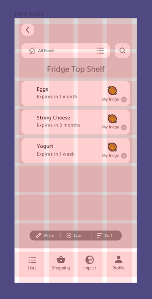

# DH 110: Interface Design
#### Karen Li | Fall 2022

## Overview
My project focuses on reducing food waste via a food tracking app called NoWaste. NoWaste allows you to keep a log of your food items, providing information on expiration dates, storage information, and more. The goal of interface design is to digitize low-fidelity wireframes and create a style that will act as a guide for high-fidelity prototyping; it is another big step towards realization of the end product. I used the app Figma for this process. I decided to focus on one of the ‘Fridge List’ screens and created different typographic, shape, and color variations for the screen. I conducted color-contrast accessibility tests as well as an impression test. 

Please click <a href="https://www.figma.com/file/dW4rmLWqa5iiaICyJrNZeS/DH-110-Assignment-5">here</a> to access the digitized wireflow.

## Layout

## Typographic Variations

## Shape Variations

## Color Variations 

## Color-Contrast Accessibility Tests

## Impression Test
Please click <a href="https://drive.google.com/file/d/10dOBRFijorim42OmT5GOaflOKdf8Ncgv/view?usp=sharing">here</a> to access the voice recording of the impression test.

The user thought the screen was pleasing to the eye and liked the colors. They liked how the buttons were round and that there weren't sharp edges. It seems that they liked the font, since they mentioned that it was easy to read and not distracting. Based on looking at the screen, they assumed it was an app to keep track of expiry dates. They said they think it would help with grocery shopping and planning meals.

I am happy with the result of the impression test, since the user did not mention any flaws. However, I think that going forward I will ask for a couple more opinions just to make sure that any flaws are not missed. 

## Interface Design System
Here is my finalized design system:

You can access the design system and my screen variations <a href="https://www.figma.com/file/QltjLwoNWWRIV8JwCFWkK7/Assignment-6">here</a>.

## Decision Making Process
For the layout, I decided on 9 rows and 4 columns. I picked 9 rows and aligned my list items to the margins. This made sense to me, because my app contains a lot of list items, so I wanted a reasonable amount of list items on the screen. It seems that 4 columns is pretty common for mobile applications and since I have four navigation icons, I decided on that. I set the gutter to 11, which is right before where the buttons end. 

I originally used Hind Kochi for the text in the Low-Fidelity prototyping, because I thought it fit very well - it is a nice and clean sans-serif font. I tried two other fonts: DM Mono which is a sans font, and Manrope which is another sans-serif font. I didn’t like how DM Mono looked; it reminded me of reading programming code. I was deciding between Manrope and Hind Kochi, but ultimately went with Hind Kochi since I think Manrope looks a bit too playful. I am glad I was able to find the font even before the assignment.

As for the buttons, I tested three different corner radii: 8, 15, and 25. This was an easier choice for me to make. In the actual NoWaste app, these buttons each have different corner roundness. So, I wanted to standardize the corner roundness for all the buttons. I wanted the buttons to look round, but not too round. Naturally, I settled on the corner radius of 15. The corner radius of 8 was not round enough and actually looked a little bit sharp. The corner radius of 25 was too much, since the search and back buttons now look more like circles. Also, I didn’t like how round the list item became. I think the corner radius of 15 is quite right; all the buttons still look like rectangles. 

For the colors, I extracted the app’s logo which consisted of dark gray and mint green colors. I think dark gray makes perfect sense for the text and I liked mint green. It is a nice color, not too bright or dark. Moreover, the app is meant to help users reduce food waste, and compost bins are usually green. It is a food tracking app, and vegetables - a prime food group - tend to also be green. As such, I decided to make the background a mint green color. I wanted to keep the list items white with black text, just like how paper lists are. For the action button, I decided to use a dark green to keep with the theme. 

