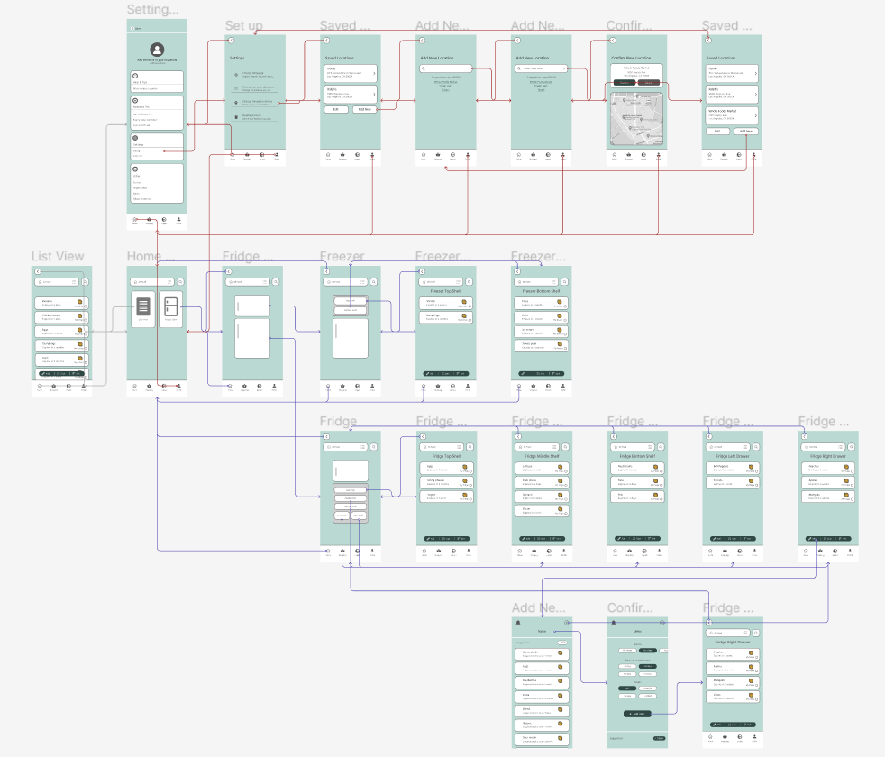

# DH 110: High Fidelity Prototype
#### Karen Li | Fall 2022

## Overview 
My project focuses on improving the existing NoWaste app, a food tracking app that allows users to reduce food waste by being more aware of the food that they have and when these ingredients will go bad. Through my user research, I found that one of the main issues involved engagement with the app. As such, I designed two features: the ‘Visual Fridge’ feature and the ‘Saved Locations’ feature. The visual fridge allows users to click into specific sections of their fridge and see what ingredients are there. Users can use the NoWaste app to quickly check their fridge instead of physically having to go to the kitchen. The ‘Saved Locations’ feature enables users to save the locations of their homes and grocery stores they frequent. When the app detects the user is at the grocery store, it will alert the user to open the shopping list in the app; this way, the user will not forget to buy any important ingredients. When the app detects the user is at home after a grocery trip, it will send a notification reminding the user to log their groceries into the app.

This high fidelity prototype is designed to translate the proposed features visually into the app. The high fidelity prototype looks very similar to the end-product in terms of detail and functionality. The goal is to test and evaluate its design, so that further improvements can be made before the product is finalized. 

I used Figma for this high fidelity prototype. I translated my low fidelity wireframes into high fidelity using the design system I created in the previous assignment. Additionally, I changed a few things from my low fidelity prototype. First, the select button uses a ‘checkmark’ icon. I changed it to a ‘radio’ icon since I believe it is more intuitive. Secondly, I changed the word ‘Write’ to ‘Add’ in the action bar. I think it makes more sense to ‘Add’ an item instead of to ‘Write’ an item. I also utilized components, which is a very helpful function in Figma. To illustrate the wireflow, I used the plugin Autoflow.

## Tasks
Task 1: Navigate to specific section of the fridge
- Can you tell me what is in the middle shelf of the fridge?
Task 2: Add a new item in a specific section of the fridge
- Can you add ‘Limes’ to the right drawer of the fridge?
Task 3: Add a new location
- Can you add ‘Whole Foods Market’ to your ‘Saved Locations’?

**The purple flow lines represent Tasks 1 and 2. 
The red flow lines indicate Task 3.**

## Wireflow

## Interactive Prototype
Click <a href="https://www.figma.com/file/czR3N08g49YFkTxlKsBVpg/DH110-Assignment-7?node-id=0%3A1&t=5NE51X7mr5qCRzPc-1">here</a> to access the Figma file. 

CLick <a href="https://www.figma.com/proto/czR3N08g49YFkTxlKsBVpg/DH110-Assignment-7?page-id=0%3A1&node-id=1%3A431&viewport=-1272%2C556%2C0.37&scaling=scale-down&starting-point-node-id=1%3A431">here</a> to access the **Interactive Prototype.**

## Cognitive Walkthrough
To be updated. 

