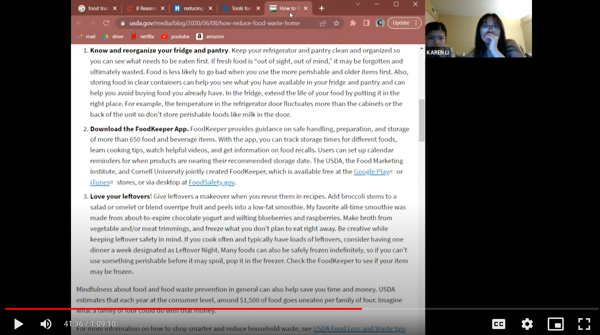
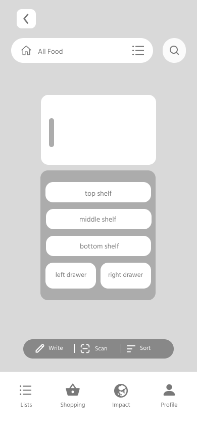
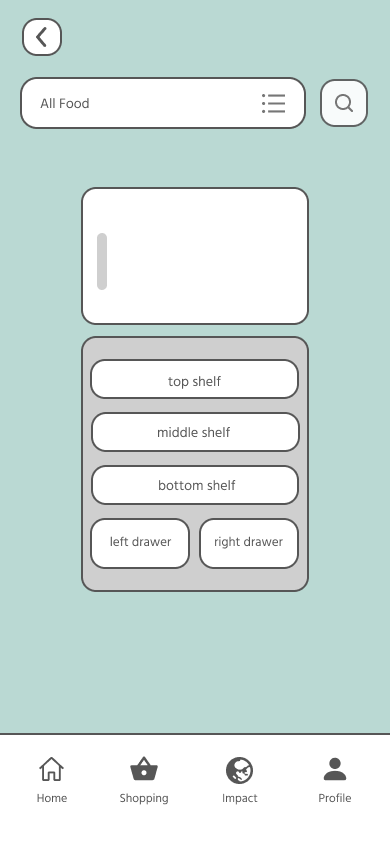

# Reducing Food Waste Via Food Tracking
### Karen Li | DH 110 UX+UI Design | Fall 2022

## Introduction
My DH 110 project this quarter focuses on one of the 17 United Nations Sustainable Development Goals – Goal #12: Responsible Consumption and Production. Since the goal is quite broad and encompasses many aspects, I wanted to focus more on the ‘consumption’ aspect as I feel it is more relevant and applicable to the average person. Consumption can mean many different things – food, clothes, transportation, products, etc. Specifically, I wanted to bring attention to food waste, since it is something I care about and have personally experienced. 

The app I have decided to research is called NoWaste, a food tracking app; users can track the amount of food they have as well as their expiration date. Additionally, users can view the value they get from the food they buy (and how much money they have lost through expired foods). And so, my hopes for this project is to improve the NoWaste app and its user experience to bring more traction to it.

## Design statement 
Food waste is a huge problem in the United States. According to Feeding America, 108 billion pounds of food is wasted each year in the United States. This accounts for almost 40% of food in the United States. Personally, I try to do the best I can to reduce my own carbon footprint, and that includes food waste. I use a lot of leftovers, only buy the foods that I need, and try to shop locally whenever possible. However, some of these methods take a lot of time and effort, which not everyone has. And so, a simple and effective way for everyone to reduce their food waste is by using the NoWaste app, which is free! 

The issue is that the NoWaste app and other similar food tracking apps are relatively unknown. You hear of calorie-tracking and meal-tracking apps, but not apps where you can track what food you have and when it expires. As such, my main goal for this project is to improve the NoWaste app so that it inspires and motivates more individuals to use it, so that they can reduce their food waste by being better informed about their food ingredients.

## Competitor Analysis 
To begin this project, I conducted a heuristics evaluation on the Poshmark website and the NoWaste app. Both products allow users to reduce their consumption, via secondhand shopping and tracking food. The Poshmark website can be very overwhelming especially for a first-time user, and it feels very cluttered. It violates several heuristics, and overall I do not think it is a very intuitive site. On the other hand, the NoWaste app is more minimalistic, as it uses simple colors and shapes. Although it may seem easier to use, I discovered some features that were not very intuitive and required exploration. While the Poshmark website overall performed worse than the NoWaste app on the heuristic evaluation, ultimately I decided with the NoWaste app, because of two reasons: it had more potential for creative freedom and I was more passionate about food waste. Check out the full heuristic evaluation <a href="https://github.com/karegg/DH110/tree/main/Assignment01" target="_blank">here</a>. 

The second part of the competitor analysis consists of usability testing. Usability testing (UT) aims to uncover any usability issues by testing a product’s functionality and design. I wanted to examine whether common tasks in the NoWaste app are completed with ease or difficulty, so I recruited a participant to complete a pilot UT. The three tasks I asked my participant to do were as follows:
Display only the items in the fridge category
Add ‘eggs’ and ‘bananas’ to the ‘Essentials’ function
Let the app know that you have consumed ‘pasta’
While my participant was able to complete all three tasks successfully, they had a little difficulty with the third task. However, they were not annoyed or upset at all, which made me conclude that what user researchers may deem as an usability issue, users may not at all. Despite this, it is the user researcher’s responsibility to eliminate these minor problems to ensure a seamless and smooth user experience. View the full usability testing <a href="https://github.com/karegg/DH110/tree/main/Assignment02" target="_blank">here</a>.

## User Research
Moving on, I wanted to learn more about my users – individuals who use or are interested in using food tracking apps. Thus, I conducted a contextual inquiry to understand what aspects of the app can be better designed for a better experience. My participant is a potential user, as they are someone who regularly food tracks, but not with an app. I employed participatory observation, observing them as they completed the following three activities:
1. Can you show me all the things you do to reduce waste in your home?
2. I want you to learn more about food tracking; it should be related to food waste.
3. Now, I want you to look for and download a food tracking app.

From this contextual inquiry, I made some interesting insights. To food track, they usually just look at their fridge. It’s like a visual reminder of what they can eat and what they need to buy. However, it is also easier for them to forget about snacks they buy, as snacks aren’t kept in the fridge. They also think that they would only be likely to use food tracking apps if they noticed they had issues with eating foods before they expire. See more <a href="https://github.com/karegg/DH110/tree/main/Assignment03" target="_blank">here</a>.

## UX Storytelling
UX storytelling allows the user researcher to situate themselves into the user’s point of view. The goal is to understand the user’s needs, motivations, goals, challenges, and frustrations. Thus, in order to better empathize with the user, I created two personas and scenarios based on my previous research. 

My first persona is Margot, a 31 year old stay-at-home mom. She wants to plan grocery trips and her family’s meals more efficiently. However, she does not have a lot of free time and easily gets overwhelmed looking at her stuffed fridge; this results in her throwing out food she forgets about. The visual fridge feature solves this issue, as it allows her to see what food is stored in each section of her fridge. 

My second persona is Chad, a young fit professional. His goals involve being aware of his diet so he can reach his fitness goals, reducing food waste to save money, and reducing unnecessary grocery trips. Since he works a fast-paced job, he is often forgetful and this has translated to other aspects of his life. He often forgets to buy certain ingredients when grocery shopping, meaning he usually has to make a second trip to the store.  The ‘Saved Locations’ feature can help with Chad’s problem. The app will ping him every time he is at a ‘Saved Location’, such as at the grocery store or when he arrives home after a shopping trip; this will ensure that Chad will look at the shopping list at the store and not forget any items. View the UX storytelling <a href="https://github.com/karegg/DH110/tree/main/Assignment04" target="_blank">here</a>. 

 

## Low-fidelity Prototype
After working on the UX storytelling, I came up with two features to solve each persona’s pain point; the visual fridge feature and the ‘Saved Locations’ function. In order to test the functionality and intuitiveness of these features, I created a low-fidelity prototype. Then, I recruited a participant to test out the wireflow. I gave them the following three tasks:
1. Can you tell me which items are in the middle shelf of the fridge?
2. Can you add ‘Limes’ to the right drawer of the fridge?
3. Can you add ‘Whole Foods Market’ to your Saved Locations in the app?

My participant was able to complete all the tasks successfully although they had a little bit of trouble with the last task. I think I may have to revise where this feature can be accessed, as otherwise this feature may be hidden to users. See the full low-fidelity prototype <a href="https://github.com/karegg/DH110/tree/main/Assignment05" target="_blank">here</a>.

  

## Interface Design System
Before working on the high fidelity prototype, I created an interface design system that I could apply to all my wireframes. I created three typographic variations, button shape variations, and two color variations. I also utilized the same layout design for all my wireframes. If you would like to read more about my design choices, you can click more <a href="https://github.com/karegg/DH110/tree/main/Assignment06" target="_blank">here</a>.

## High-fidelity Prototype
The purpose of a high-fidelity prototype is to simulate how a user would interact with the actual realized product. It is to test the functionality and design of the prototype, so improvements can be made before the product becomes finalized. I applied my interface design system to my low-fidelity prototype, changed a few details and recruited a new participant. This participant received the same tasks as in the low-fidelity prototype testing. Here is a <a href="https://www.figma.com/proto/czR3N08g49YFkTxlKsBVpg/DH110-Assignment-7?page-id=0%3A1&node-id=1%3A431&viewport=-1272%2C556%2C0.37&scaling=scale-down&starting-point-node-id=1%3A431" target="_blank">link</a> to the prototype – please feel free to try out the tasks yourself!

  

## Cognitive Walkthrough
After creating my high-fidelity prototype, I conducted an impression test and cognitive walkthrough with two of my classmates. During the impression test, both of them did not understand the purpose of the NoWaste app. This led me to think that I should update the design to make the purpose more clear and perceivable. Additionally, both of them noted that there were some points of confusion while they were using the app, so this is another reason why I need to make my app more intuitive. On the other hand, they both though my design was consistent. If you would like to see the full notes of the cognitive walkthrough, please click <a href="https://github.com/karegg/DH110/tree/main/Assignment07" target="_blank">here</a> and scroll down to the section that says “Cognitive Walkthrough”.

## Usability Testing #1
To make my design more clear, I changed the basket icon text at the menu bar from ‘Shopping’ to ‘To-Buy’. During my cognitive walkthrough both my classmates thought this app afforded online shopping. This is not the case, as the basket icon takes you to a screen that shows you your shopping list of ingredients to buy. Hence, I decided to make this change. My participant completed the same three tasks I assigned in low-fidelity prototyping and high-fidelity prototyping. My participant completed the first and second tasks very quickly and with ease. However, they really struggled with finding where ‘Saved Locations’ was. As such, I will revise the location where ‘Saved Locations’ can be assessed. I noticed this issue with a previous participant of mine, but I chalked it up to them not fully understanding the task. I should have made this revision then since first-time users will also likely not be aware of the feature; this is a fault on my part, but now I know in the future to listen carefully to my participants. Additionally, I plan on changing ‘To-Buy’ back to ‘Shopping’, since my participant thought that clicking on the basket icon would also take him to a screen where they could buy things. I feel that this is a rather minor issue, as once the user actually clicks on the basket icon, they will understand that it is a place for shopping lists. Here is the <a href="https://drive.google.com/file/d/12zLXtfS-h8yFO9-y1btnxefXnyuVpyrB/view?usp=sharing”_blank">link</a> to the video recording.

## Usability Testing #2
I changed the location of where ‘Saved Locations’ can be accessed. Instead of putting it within Setup, I put it next to Setup so it is more clearly perceivable. When scrolling through the Profile screen, even first-time users will see ‘Saved Locations’. If they are curious and click on it, they will understand the purpose of the feature. To make sure, I conducted another usability testing on a new participant. The participant was able to complete tasks 1 and 2 quickly as expected. They were also able to complete task 3 quicker than the other participants. In the beginning of task 3, they were a bit unsure where to click, but once they navigated to ‘Settings’ they were able to find ‘Saved Locations’. As such, I think this change was very necessary. I also changed ‘To-Buy’ back to ‘Shopping’. You can view the video recording <a href="https://drive.google.com/file/d/1kP-iluyjVxSqDVERhqixbyiqqJ1dXeku/view?usp=sharing”_blank">here</a>.  

## Pitch
To be updated after this video :relaxed:

## Conclusion
This project was very time-consuming, extensive, interesting, and rewarding. I started the project thinking that UX/UI design is something I want to pursue as a career. Throughout the process, this wavered a bit but now that the project is complete, it has been solidified that I definitely want to do more UX/UI. I have definitely learned and grown a lot throughout this experience.

I discovered my favorite aspects of UX/UI design. I loved creating the low-fidelity prototype, interface design system, and high-fidelity prototype. I really enjoyed creating the interactions between the wireframes as well as conducting the usability testing. On the other hand, I did not enjoy the heuristic evaluation and contextual inquiry as much. However, I think this may be based on the fact that there were pretty strict time constraints; in a work environment where I imagine I would have more time to conduct user research, I think I would enjoy it more. So, I think I definitely lean more on the UI side of things, but I am still interested in user research. 

Another key takeaway I’ve learned is that there is a lot of uncertainty. I constantly questioned myself during this process, but the thing is – you just have to trust yourself. And my project turned out well. It’s definitely still a work in progress and needs revisions, but overall I have made improvements to the app. That is to say, I had a great experience and I am looking forward to doing more UX/UI.

